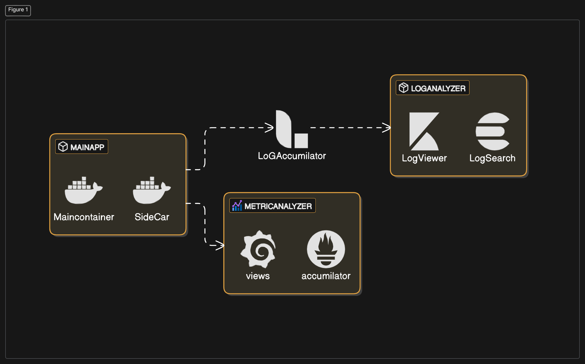

# Kubernetes and Docker-based Application with Centralized Logging and Monitoring

This project demonstrates how to run an application with centralized logging and monitoring using Docker Compose and Minikube. It involves:

1. A primary service (Node.js) that generates logs and exposes Prometheus metrics.

2. A sidecar container to filter and send error/warn logs.

3. Logstash to parse and forward logs to Elasticsearch for storage.

4. Kibana for visualizing logs.

5. Prometheus to scrape metrics from the Node.js service.

6. Grafana to visualize Prometheus metrics.

<!-- embed an image from file for the architecture -->


## Table of Contents

1. Docker Compose Setup
2. Prerequisites
3. Running the Application
4. Accessing the Services
5. Minikube Setup
6. Prerequisites
7. Running the Application in Minikube

Docker Compose Setup
Prerequisites
Docker and Docker Compose installed on your local system.
Docker network access for all containers.
Running the Application
Clone the repository:

```bash
git clone <https://github.com/your-repo/centralized-logging-monitoring.git>
cd centralized-logging-monitoring

```

Build and start the containers using Docker Compose:

```bash
docker-compose up
```

This will:

Start the primary-service (Node.js app with log generation and Prometheus metrics).
Start the sidecar container (filtering logs and sending error/warn logs).
Start Logstash, Elasticsearch, and Kibana for log aggregation and visualization.
Start Prometheus for metrics collection.
Start Grafana for metrics visualization.

Accessing the Services
Prometheus UI: <http://localhost:9090>
Grafana UI: <http://localhost:3000>
Username: admin
Password: admin
Kibana UI: <http://localhost:5601>
Minikube Setup
Prerequisites
Install Minikube and kubectl.
Ensure Minikube is running:

```bash
Copy code

minikube start
```

Running the Application in Minikube
Deploy the services: Apply the Kubernetes configurations for the services in the Minikube cluster.

Create Kubernetes resources:

First, create the required namespaces and deploy the services using Kubernetes manifests.
The following files can be used to deploy the services in Minikube:

## docker-compose-to-k8s.yaml

```yaml
apiVersion: apps/v1
kind: Deployment
metadata:
  name: primary-service
spec:
  replicas: 1
  selector:
    matchLabels:
      app: primary-service
  template:
    metadata:
      labels:
        app: primary-service
    spec:
      containers:
      - name: primary-service
        image: node:16
        ports:
        - containerPort: 8080
        volumeMounts:
        - name: log-volume
          mountPath: /logs

---
apiVersion: v1
kind: Service
metadata:
  name: primary-service
spec:
  selector:
    app: primary-service
  ports:

- protocol: TCP
    port: 8080
    targetPort: 8080


```

You can also create similar Kubernetes resources for the sidecar, logstash, elasticsearch, kibana, prometheus, and grafana services by translating your docker-compose.yml to Kubernetes deployment and service resources.

Apply resources to Minikube:

```bash
kubectl apply -f docker-compose-to-k8s.yaml
```

Expose Services: Expose each of the services (e.g., Prometheus, Grafana, Kibana) using kubectl expose or kubectl port-forward.

Accessing the Services in Minikube:

For Kibana, Prometheus, and Grafana, use port-forwarding:

```bash
kubectl port-forward service/kibana 5601:5601
kubectl port-forward service/prometheus 9090:9090
kubectl port-forward service/grafana 3000:3000
```

Now, you can access these services locally at:

Prometheus: <http://localhost:9090>

Grafana: <http://localhost:3000>

Kibana: <http://localhost:5601>

Docker Compose Configuration
Here is the docker-compose.yml configuration to run the stack with logging and monitoring:

```yaml
version: '3.8'

services:
  primary-service:
    image: node:14
    container_name: primary-service
    ports:
      - "3000:3000"  # Web app exposed on port 3000
      - "9090:9090"  # Prometheus metrics exposed on port 9090
    environment:
      - PROMETHEUS_PORT=9090
    volumes:
      - ./logs:/mnt/logs  # Shared volume for logs between primary and sidecar containers
    command: >
      sh -c "npm install && npm start"
    depends_on:
      - sidecar-container
    networks:
      - app-network

  sidecar-container:
    image: busybox
    container_name: sidecar-container
    volumes:
      - ./logs:/mnt/logs  # Shared volume for logs between primary and sidecar containers
    command: >
      sh -c "tail -f /mnt/logs/app.log | grep -E 'WARN|ERROR' >> /mnt/logs/filtered_logs.log"
    networks:
      - app-network

  logstash:
    image: logstash:7.10.0
    container_name: logstash
    ports:
      - "5044:5044"
    volumes:
      - ./logs:/mnt/logs  # Shared volume for logs
    environment:
      - LS_JAVA_OPTS="-Xmx256m -Xms256m"
    networks:
      - app-network

  elasticsearch:
    image: docker.elastic.co/elasticsearch/elasticsearch:7.10.0
    container_name: elasticsearch
    environment:
      - discovery.type=single-node
    volumes:
      - elasticsearch-data:/usr/share/elasticsearch/data
    ports:
      - "9200:9200"  # Exposed for Kibana to query
    networks:
      - app-network

  kibana:
    image: docker.elastic.co/kibana/kibana:7.10.0
    container_name: kibana
    ports:
      - "5601:5601"  # Exposed Kibana dashboard on port 5601
    environment:
      - ELASTICSEARCH_HOSTS=http://elasticsearch:9200
    networks:
      - app-network

  prometheus:
    image: prom/prometheus:latest
    container_name: prometheus
    ports:
      - "9090:9090"  # Prometheus metrics server
    volumes:
      - ./prometheus.yml:/etc/prometheus/prometheus.yml  # Prometheus config file
    networks:
      - app-network

  grafana:
    image: grafana/grafana:latest
    container_name: grafana
    ports:
      - "3001:3001"  # Exposed Grafana dashboard on port 3001
    environment:
      - GF_SECURITY_ADMIN_PASSWORD=admin  # Default Grafana password
    networks:
      - app-network

networks:
  app-network:
    driver: bridge

volumes:
  elasticsearch-data:
    driver: local

```

### Conclusion

This setup provides a robust logging and monitoring system using Elasticsearch, Kibana, Prometheus, and Grafana, along with centralized log aggregation and visualization of application metrics.
You can run this setup using Docker Compose for local development or deploy it to Minikube for testing in Kubernetes.
